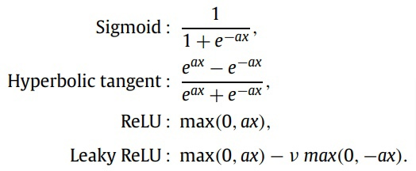
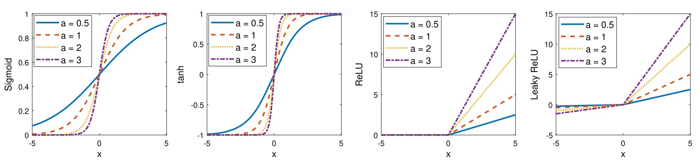
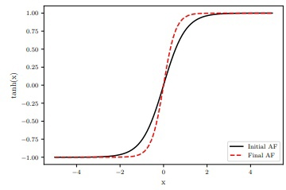
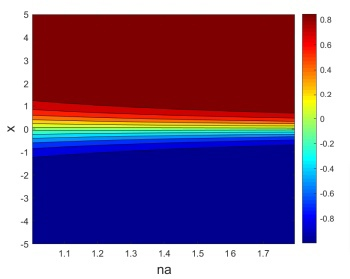
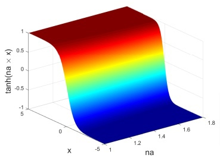
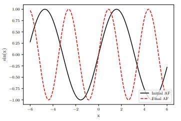
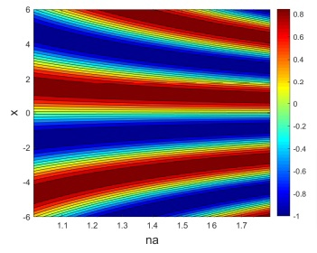
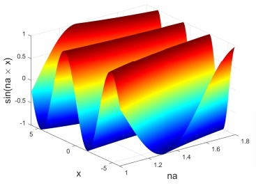

# Анализ статьи "Adaptive activation functions accelerate convergence in deep
and physics-informed neural networks"

- [Ссылка на статью](https://arxiv.org/pdf/1906.01170.pdf)

### Адаптивные функции активации
- Роль функции активации заключается в том, чтобы оперделять, должен ли конкретный нейрон активироваться или нет и насколько. 
- Если функция активации отсутствует, веса и смещения выполняют простое линейное преобразование, что соответствует случаю линейной регрессионной модели. Такая линейная модель проста для решения, но ограничена. 
- Нелинейная функция активации выполняет нелинейное преобразование входных данных, что позволяет моделе решать более сложные задачи. 
- В алгоритме обратного распространения вычисление градиента функции потерь включает в себя градиент функции активации. Функции активации делают обратное распространение возможным, поскольку градиенты поставляются для обновления весов и смещений.
- Следовательно, без дифференцируемой нелинейной функции активации это было бы невозможно. Таким образом, необходимо выбирать функцию активации, менее подверженную проблеме затухающего и взрывающегося градиента на конкретных данных и задаче.
- Примеры параметризованных функций активации.
    
    

### Результаты рассчетов
- По-сути, дублируют результаты из этой [статьи](https://arxiv.org/pdf/1909.12228.pdf).
- Пример того, как адаптируется функция активации:
    1. В случае tanh:

        
        
        
    2. В случае sin:

        
        
        