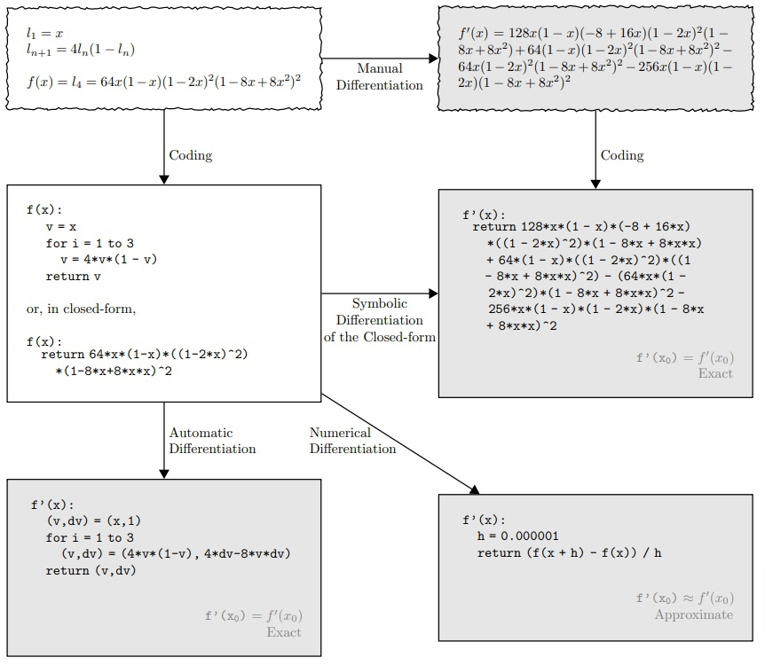
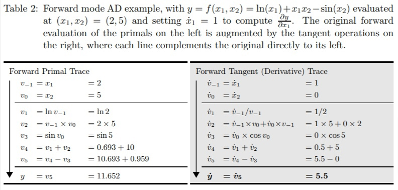
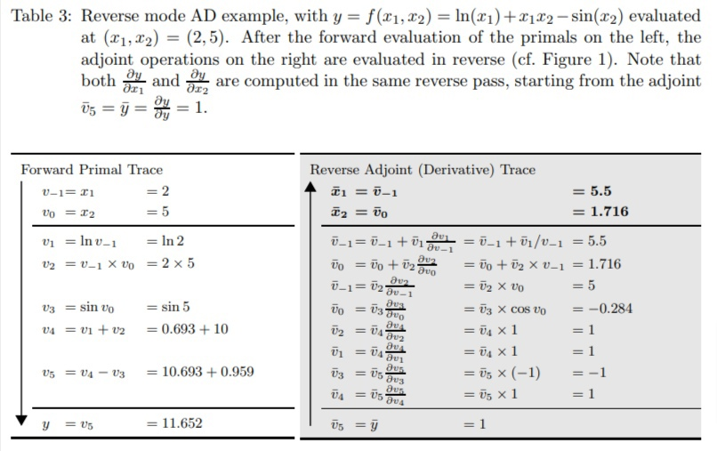
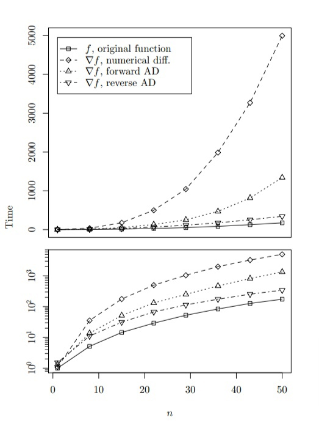

# Анализ статьи "Automatic Differentiation in Machine Learning: a Survey"

- [Ссылка на статью](https://arxiv.org/pdf/1502.05767.pdf)

### Основные выводы
- AD как технический термин относится к семейству методов, которые вычисляют производные путем накопления значений во время выполнения кода для создания числовых оценок производных, а не выражений производных. Такой подход позволяет оценивать производные с машинной точностью.
- Отличие автоматического дифференцирования от численного и символьного. 
- Численное дифференцирование может быть неустойчиво.
- Если использовать подход символьного дифференцирования к некоторой сложной функции f(x) то неизбежно будут возникать вложенные дубликаты любых вычислений. Такой подход может легко привести к появлению экспоненциально больших выражений, для вычисления которых потребуется много времени.
- В основе AD лежит следующий подход: применять символьное дифференцирование на уровне элементарных операций и
сохранять промежуточные численные результаты. Так работает AD в режиме прямого прохода. 
- Демонстрация прямого и обратного прохода. 
- Время оценки функции свободной энергии Гельмгольца смешанной жидкости на основе уравнения состояния Пенга-Робинсона. На графиках показано время оценки f и градиента ∇f с численным дифференцированием (центральной разностью), прямым режимом AD и обратным режимом AD в зависимости от количества переменных n. На нижнем графике используется логарифмическая шкала для иллюстрации поведения при малых n. 
- Остальные разделы рассказывают об тонкостях реализации, истории и областях применения.