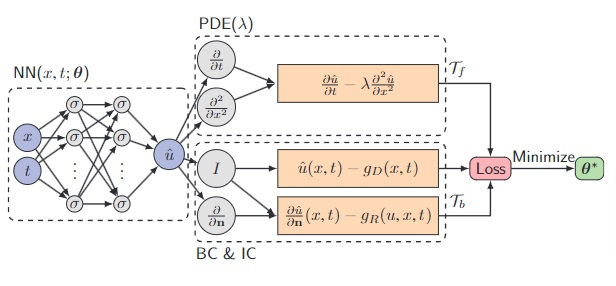

# Анализ статьи "DeepXDE: A Deep Learning Library for Solving Differential Equations"

- [Ссылка на статью](https://epubs.siam.org/doi/epdf/10.1137/19M1274067)
- [Статья, в которой появился термин Pinn](https://www.sciencedirect.com/science/article/pii/S0021999118307125)

### Общие слова
- Метод PINN относится к новому разделу SciML.
- Можно использовать для интегральных, фрактальных и стохастических уравнений.
- Используется для уравнений в сильной форме, то есть написаных как в УМФ, а не через интегралы (Остроградский-Гаусс, Грин).
- Чаще используются арихитектуры `feed forward` и `resnet`.

### Виды дифференцирования
1. Ручные методы.
2. Конечные разности и другие численные методы.
3. Символьные.
4. Автоматические.

### Принцип работы автоматического дифференцирования
- Прямой проход: для вычисления значений переменных.
- Обратный проход: для вычисления производных.
  - Пример вычисления на графе вычислений нейронной сети.

### Особенности и примечания к автоматическому дифференцированию
- Автоматическое дифференцирование (АД) эффективен по времени при больших размерностях, то есть когда нужно найти много производных по каждой из компанент вектора или матрицы.
- АД Taylor Mode для вычисления производных n-ого порядка (см. работы J. Bettencourt, M. J. Johnson, D. Duvenaud - Taylor-mode automatic differentiationfor higher-order derivatives in JAX).

### Эвристики по улучшению метода
- Можно (нужно) добавлять веса к потерям с разных точек.
- Оптимизация с помощью Adam (первого порядка) и L-BFGS (второго порядка). По опыту авторов, L-BFGS сходится быстрее, но может сойтись в локальный минимум.
- Необходима настройка параметров, таких как размер сети, learning rate, количество точек - для этого можно использовать callback функцию.
- Глубина сети может быть недостаточной для сложных нелинейных уравнений (все зависит от гладкости решения).
- Запуск на разных начальных данных и выбор модели с наименьшим значением функции потерь.
- В одномерном случае при `u(0)=u(l)=0` можно использовать `v=x(x-1)PINN`.
- Точки для вычисления остатков можно выбирать разными способами.
    * Можно выбрать их один раз в начале (случайно или сеткой) и не менять.
	* Можно выбирать на каждой итерации обучения разные точки.
    * Можно выбирать точки, улучшая их расположение в зависимости от величины функции потерь.
- Предлагается использовать градиентный спуск по мини-батчам (особенно для задач высокой размерности).
- Теорема Пинкуса для однослойной нейронной сети.
    * Показывает, что полносвязный слой `feed forward` с достаточным количеством нейронов может равномерно непрерывно аппроксимировать любую функцию и ее частные производные.
- Ошибки при решении связаны с различными факторами: 
    * Аппроксимация - разница между действительным решением и самой ближайшей из функций, которую можно выбрать из всего семейста функций, которые могут быть представлены выбранной сетью.
    * Оценка - связана с конечностью набора точек для обучения.
    * Генерализация - связанная с выбором точек (их положением и количеством) в которых находятся остатки. Ошибки аппроксимации и оценки вместе дают ошибку генерализации.
    * Оптимизатия - связана с тем, что оптимизатор ищет лучшую функцию из семейства, но находит лишь ее аппроксимацию, с точностью зависящей от learning rate и числа шагов.
    * Более сложная сеть будет обладать меньшей ошибкой аппроксимации и большей ошибкой генерализации - bias-variance tradeoff.
    * Ошибки - лишь теоретические оценки, вычислить их значения невозможно на данный момент.

### Сравнение с FEM
- В статье приведена таблица сравнения метода с PINN с методов конечного элемента.

| **Feature**          | **PINN**                    | **FEM**            
|----------------------|-----------------------------|--------------------
| **Basis function**   | Neural network (nonlinear)  | Piecewise polynomial (linear)
| **Parameters**       | Weights and biases          |Point values
| **Training points**  | Scattered points (mesh-free)| Mesh points
| **PDE embedding**    | Loss function               | Algebraic system
| **Parameter solver** | Gradient-based optimizer    | Linear solver
| **Errors**           | Approximation, Generalization, Optimization | Approximation/quadrature errors
| **Error bounds**     | Not available yet           | Partially available |
  
### Метод адаптивного уточнения на основе остатков RAR
- Уплотняет точки там, где это необходимо.
    #### Процедура 2.2: Улучшение распределения остаточных точек для обучения (RAR)
    #### Шаг 1: Выбор начальных остаточных точек
    - Выберите начальные точки.
    - Обучите нейронную сеть ограниченное количество итераций.

    #### Шаг 2: Оценка среднего остатка ДУ
    - Оцените средний остаток ДУ с использованием метода Монте-Карло. Это делается усреднением значений по набору случайно выбранных уполотненных наборов точек.

    #### Шаг 3: Обновление и повторное обучение
    - Если средний остаток ДУ меньше некоторого порога, завершите процедуру.
    - В противном случае добавьте новые точки с наибольшими остаточными значениями из выбранного набора к начальным остаточным точкам, повторно обучите сеть и вернитесь к Шагу 2.