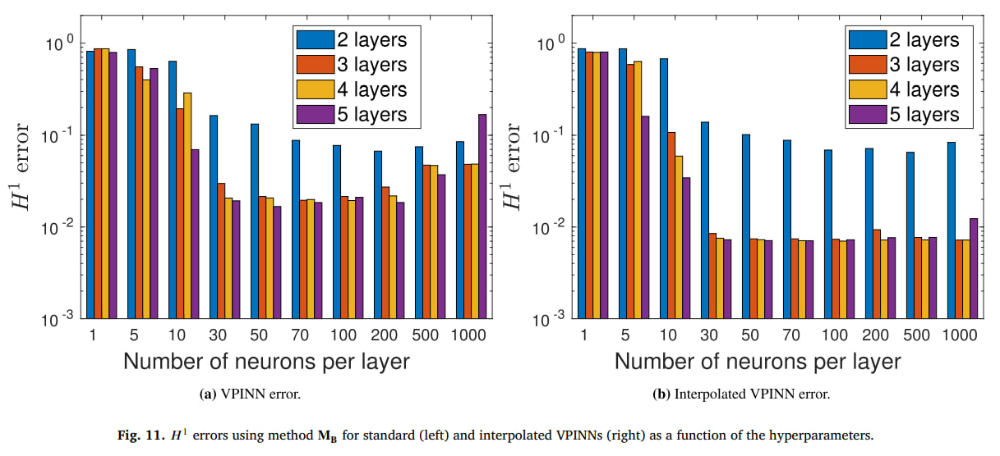

# Анализ статьи "Enforcing Dirichlet boundary conditions in physics-informed neural networks and variational physics-informed neural networks"

- [Ссылка на статью](https://arxiv.org/pdf/2210.14795.pdf)

- В статье рассматриваются четыре возможных подхода по введению граничных условий Дирихле (первого рода) в функцию потерь:

    1. Наиболее часто используемый подход. Граничные условия накладываются с помощью дополнительных членов в функции потерь, которые штрафуют за несоответствие между выходными данными нейронной сети и заданными граничными условиями - этот подход используется в большинстве статей.

    2. Точное наложение граничных условий Дирихле. В этом методе добавляется необучаемый слой в конце нейронной сети, чтобы модифицировать ее выходной сигнал w в соответствии с правилом: 
    $Bw = \overline{g} + φw$, где $\overline{g} ∈ C^0 (Ω)$ — расширенная функция $g$ внутрь области $Ω$ (т. е. $\overline{g}_{|Γ_D} = g$), а $φ ∈ C_0 (Ω)$ является приближенной функцией расстояния (ADF) до границы $Γ_D$, т. е. φ(x) = 0 тогда и только тогда, когда $x ∈ Γ_D$, а в других местах он положителен. На этапе обучения минимизируют величину $R^2_{PINN}(Bw)$ или $R^2_h(Bw)$ (подробнее формулы можно посмотреть статьи).

    3. Точное наложение граничных условий Дирихле как в предыдущем случае, но без нормировки ADF. Поэтому рассмотрим другую функцию $\phi = \prod\limits_{i=1}^{n_s} \phi_i$. Это гарантирует, что $\phi$ и все производные существуют и ограничены в $Ω$, хотя $\phi$ может быть очень мала в областях, близких ко многим отрезкам $s_i$.

    4. Можно использовать только в том случае, если функция потерь получена из слабой формулировки УЧП, основан на методе Нитче и вариационно обеспечивает соблюдение граничных условий.

- Сравнивается два подхода PINN и VPINN. В VPINN используется альтернативный (в консервативной форме) вид функции потерь.

- Используется гибридный оптимизатор 5000 эпох Adam затем BFGS.

- Так же проводится перебор архитектуры при фиксированной сетке.
    

- Когда нейронные сети содержат более 100 нейронов в каждом слое, ошибка увеличивается из-за аппроксимации мелких отклонений по энергии и из=за поиска локальных минимумов в многомерном пространстве.

- Когда VPINN интерполируется и нейронная сеть имеет достаточное число нейронов, ошибка становится постоянна и не зависит от размерности сети.

- Средняя точность интерполированного VPINN выше, чем у его неинтерполированного аналога.

- Для сравнения решаталей использовался FEM решатель FEniCS с открытым исходным кодом (M.S. Alnaes, J. Blechta, J. Hake, A. Johansson, B. Kehlet, A. Logg, C. Richardson, J. Ring, M.E. Rognes, G.N. Wells, The FEniCS project version 1.5, Arch. Numer.
Softw. 3)