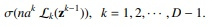
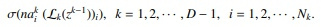
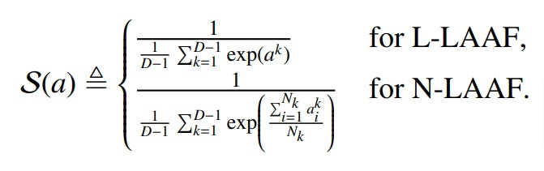
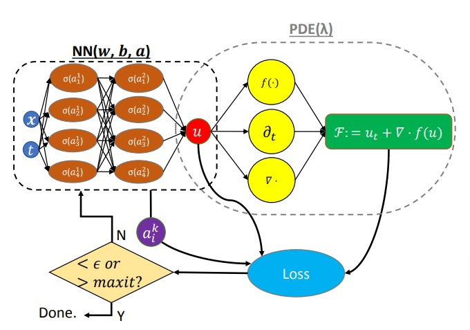
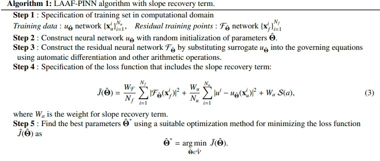

# Анализ статьи "Locally adaptive activation functions with slope recovery term for deep and physics-informed neural networks"

- [Ссылка на статью](https://arxiv.org/pdf/1909.12228.pdf)

### Общие слова
- В статье рассматривается два подхода к локально-адаптивным функциям активации:    
    1. Послойные
    2. Понейронные
- Локальная адаптация функции активации достигается введением масштабируемого параметра в каждом слое и/или для каждого нейрона отдельно, а затем оптимизация этого параметра с использованием варианта алгоритма стохастического градиентного спуска.
- Чтобы увеличить скорость обучения, в функцию потерь добавляется член восстановления наклона на основе наклона функции активации.
- Математически доказывается, что в предложенном методе алгоритмы градиентного спуска не стягиваются к субоптимальным критическим точкам или локальным минимумам при практических условиях для начальной инициализации и темпа обучения. 
- Доказывается, что динамика градиента (скорость схождения к минимуму) предложенного метода недостижима базовыми методами с любыми (адаптивными) темпами обучения. 
- Демонстрируется, что адаптивные методы для функции активации ускоряют сходимость, неявно умножая матрицы условий (conditioning matrices) на градиент базового метода без явного вычисления матрицы условий и произведения матрицы на вектор. 
- Показано, что различные адаптивные функции активации порождают различные неявные матрицы условий, а предложенные методы с восстановлением наклона ускоряют процесс обучения.

### Проблематика
- Проблема заключается в скорости сходимости, что делает невозможным применение в реальном времени.
- Одним из известных методов является dropout, но тут используем не его.
- Подходов существует множество (объединение функций, предоставление выбора, несколько выходов, трансформирование), но тут исопльзуем параметризацию.
- Такую адаптивную функцию активации предложили в [работе](https://www.sciencedirect.com/science/article/pii/S0021999119308411) введя масштабируемый параметр, который может быть оптимизирован с использованием любого метода оптимизации. 
- Математически это изменяет наклон функции активации, тем самым увеличивая процесс обучения путем изменения ландшафта потерь нейронной сети, особенно в начальный период обучения.

### Обозначения
- В [работе](https://www.sciencedirect.com/science/article/pii/S0021999119308411) предложили адаптивную функцию активации, где вводится дополнительный масштабируемый параметр na, где n≥1 - предопределенный масштабирующий коэффициент. Параметр a∈R действует как наклон функции активации. Поскольку параметр a определен для всей сети, мы называем его глобальной адаптивной функцией активации (GAAF).
- Дополнительно вводятся L-LAAF (Layer-wise locally adaptive activation functions):

    
- И N-LAAF (Neuron-wise locally adaptive activation functions):

    

### Применительно для PINN
- Основной идеей адаптивной функции активации является увеличение наклона функции активации, что приводит к неисчезающим градиентам и быстрому обучению сети. 
- Понятно, что для улучшения работы NN следует увеличивать крутизну активации. Таким образом, вместо того, чтобы зависеть только от методов оптимизации, другой способ добиться этого - включить член восстановления наклона S(a), определяемый как:
    
- Такой член соответствует градиенту функции потерь, не обращаясь в нуль. Такой член заставляет сеть быстро увеличивать значение наклона активации, увеличивая скорость обучения.
- Схема сети с LAAF для уравнения Бюргерса:
    
- Алгоритм сети с LAAF для уравнения Бюргерса:
    
- Дальнейшие математические теоремы и выводы доказывают непротиворечивость и эффективность адаптивных функций активации.
- Потом предоставляются результаты на примере двумерного уравнения Пуассона и уравнения Бюргерса.