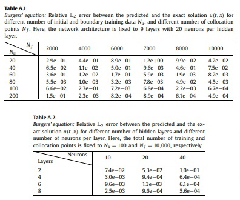

# Анализ статьи "Physics-informed neural networks: A deep learning framework for solving forward and inverse problems involving nonlinear partial differential equations"

- [Ссылка на статью](https://www.sciencedirect.com/science/article/abs/pii/S0021999118307125)

### Общие слова
- В этой статье был впервые представлен термин PINN.
- В этой работе были представлены разработки в контексте решения двух основных классов задач: 
    1. data-driven решение.
    2. data-driven исследование уравнений в частных производных. 
- В зависимости от доступных данных разработаны два различных типа алгоритмов - модели с непрерывным временем и модели с дискретным временем:
    1. Первый тип моделей образует новое семейство эффективных по данным аппроксиматоров пространственно-временных функций.
    2. Второй тип позволяет использовать сколь угодно точную неявной схему шага по времени Рунге – Кутты с неограниченным числом этапов.

### Постановка задачи
- Вводится уравнение и метод подсчета ошибки через средние квадраты.

- Используется не концепция black-box, а исследуются пользовательские функции активации и потерь.
- Важность автоматического дифференцировани и, в частности, автоматического распростронения ошибки.
- Авторы использовали L-BFGS.
- Отмечено что нет теоретического обоснования, что оптимизатор сходится к глобальному минимуму. Однако отмечено, что эмпирические данные показывают, что, если уравнение в частных производных корректно (по Адамару) и его решение единственно, то метод способен достичь хорошей точности прогнозирования при достаточной архитектуре нейронной сети и достаточном количестве точек коллокации.

### Примеры задач
- Пример с уравнением Шредингера.
- Пример с моделью с дискретным временем через Рунге-Кутту.
- Пример с двумерным уравнением Новье-Стокса через потенциалы (ровно как это было в примере с видео).
- Пример с уравнением Кортевега-де Вриза, но без визуализации.
- В аппендиксе пердставлен алгоритм и резальтат расчета для уравнения Бюргерса.
- Результаты сравнения архитектуры.

    
